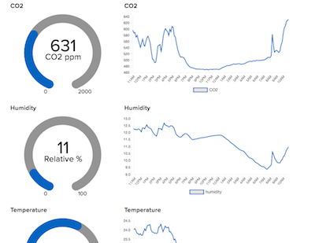

# Feather CO2 Monitor with Logging to Adafruit IO in Circuitpython 

 CO2 Monitor with logging to Adafruit IO using an Adafruit ESP32-S3 TFT 
 and Adafruit SCD-40 CO2/Temperature/Humidity breakout board

 https://www.adafruit.com/product/5483
 https://www.adafruit.com/product/5187

 SCD-40 is connected via STEMMA

 This logs using Adafruit IO to three items in a group:
 `'co2-monitor-group.co2'`, `'co2-monitor-group.temperature'`, `'co2-monitor-group.humidity'`.  You can change the names if you desire and make a cool dashboard for them or not, I'm not your dad do what you want. 
 
 Rather than hammer the network with constant updates this keeps a running average of values
 and only upates AdafruitIO every 10 minutes or so.  

 In the event of errors publishing to AdafruitIO or network errors the board will automatically
 try to reconnect or eventually reset.  The Neopixel is used to indicated network status.  
 
 Tested with Circuitpython 8.x.  You need these libraries in /lib:
 adafruit_bus_device, adafruit_display_text, adafruit_io, adafruit_minimqtt, adafruit_scd4x, adafruit_st7789, neopixel 
 

